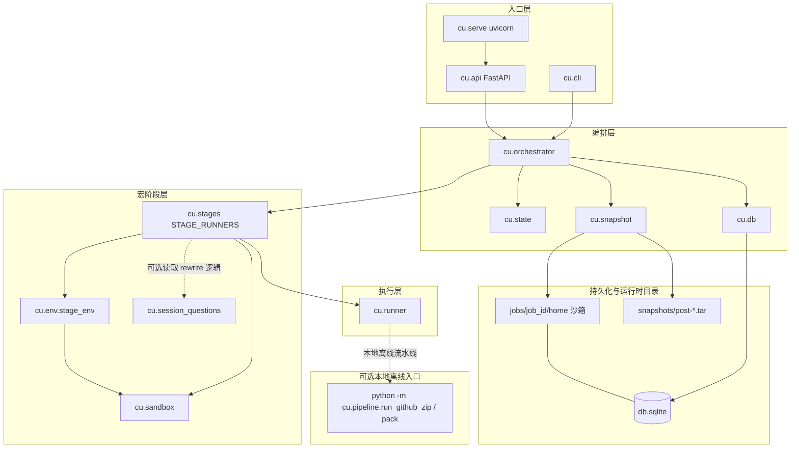
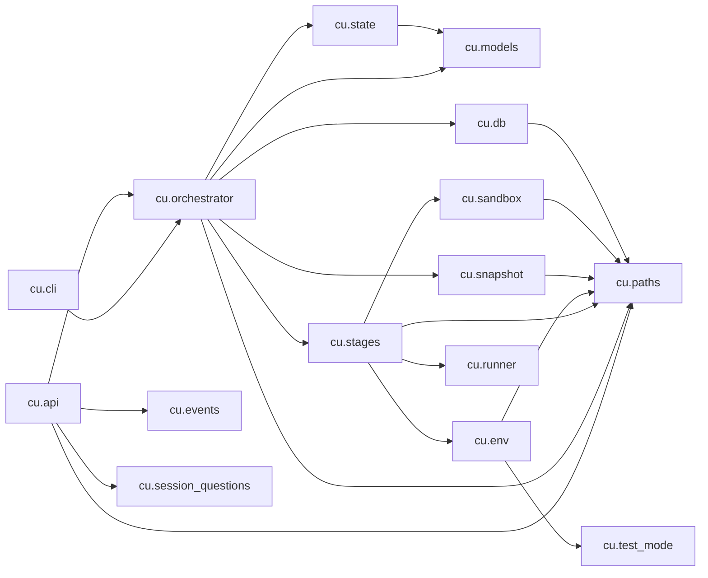
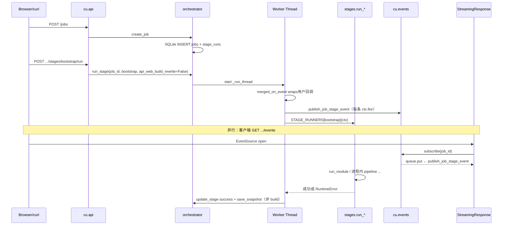
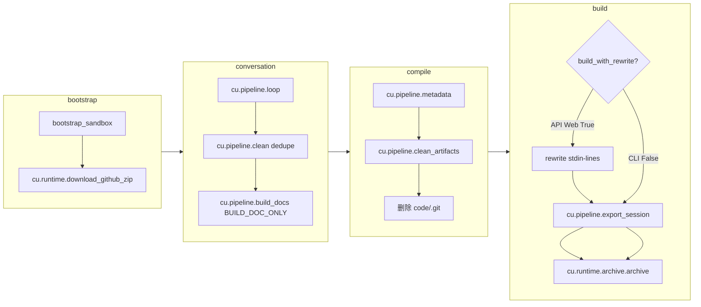

# CodeUnderstand · P3 代码 Review 指导（架构 / 调用链 / 依赖 / 优化方向）

**日期**：2026-05-13  
**用途**：供你在 MR / 迭代前对照模块边界、调用顺序与持久化语义做结构化 review；图示基于 **`cu/`** 包内 **`cu.stages.*`**、**`cu.pipeline.*`**、**`cu.runtime.*`** 的当前实现归纳。

---

## 1. 如何使用本文档

| 步骤 | 建议 |
|------|------|
| 1 | 先读 **§3 分层架构** 与 **§6 宏阶段调用**，建立「谁在何时 fork 子进程」的心智模型。 |
| 2 | 对照 **§4 模块依赖图**，确认新增改动落在合理扇区（例如 UI 不应直连 `runner`）。 |
| 3 | 用 **§7 Review 检查清单** 勾选 PR；争议点记入 **§8 优化方向** backlog。 |
| 4 | 与 **`docs/superpowers/specs/p2-api-reference.md`**（含 P3 端点）、**`docs/superpowers/plans/p3-ubuntu-verification-checklist.md`** 交叉验证行为。 |

---

## 2. 术语速览

| 符号 | 含义 |
|------|------|
| **宏阶段** | `bootstrap` → `conversation` → `compile` → `build`（SQLite `stage_runs` 一行一段）。 |
| **`JobContext`** | 单次线程执行链路上的可变上下文：`session_id`、`claude_project_dir`、`on_event`、`pid_sink`、`build_with_rewrite`。 |
| **API Web Build** | 经 **`POST .../stages/build/run`**（或 **`rerun`**）且 **`stage==build`**：`orch` 置 **`ctx.build_with_rewrite=True`** → **`run_build`** 内先 **`cu.pipeline.rewrite` stdin-lines 写回** 再 export/zip。**CLI `cu run`** 默认 **`False`**，跳过该写回步骤。 |
| **SSE Hub** | **`cu/events.py`**：`publish_job_stage_event`（worker 线程）→ `subscribe`（asyncio Queue，SSE 路由）。 |

---

## 3. 分层架构（逻辑视图）

进程内自上而下：**入口 → 编排 → 阶段 → 子进程执行器 → Python 流水线模块**。外围：**SQLite + 沙箱目录树 + tar 快照**。**编排路径已不再调用仓库内 `.sh`**（仅保留 **`install.sh`** 供人工初始化）。

**读图要点**

- **`cu/api`** 仅依赖 **`orch`**、**`events`**、**`session_questions`**、**`paths`**，**不**直接调用 **`runner`** —— 子进程边界封装在 **`stages`**。
- **`session_questions`** 直接 **`from cu.pipeline import rewrite`**，统一使用 **`cu.pipeline.rewrite`** 实现。

---

## 4. `cu` 包内模块依赖（静态依赖）

箭头表示「import / 直接调用」。**`models`**、**`paths`** 为中心枢纽。

说明：**`cu/events.py`** 仅依赖标准库 + **`asyncio`**，**不被** **`orch`** 顶层 import；**`orchestrator._run_thread`** 内 **`from cu.events import publish_job_stage_event`**，避免循环 import。

---

## 5. 运行时序列：创建作业 → API 触发 Run → SSE

---

## 6. 宏阶段调用过程（含子进程与产物）

下图汇总 **`cu/stages/`** 与各 Python 模块入口；**失败任一处抛 `RuntimeError` → orchestrator 标记 failed**。

**环境**：子进程由 **`stage_env()`** 注入 **`HOME`/`PROJECTS_DIR`/`OUTPUTS_DIR`/会话相关变量**；测试模式下 **`CU_TEST_MODE`** 叠加 **`LOOP_/BUILD_/CLASSIFY_USE_MOCK_CLAUDE`** → **`python -m cu.testing.mock_claude`**（见 **`cu/test_mode.py`**）。

**快照**：**`orchestrator`** 在每宏阶段 **success** 后（**除 `build`**）调用 **`save_snapshot(job_id, stage)`**；**`rerun_from`** 先 **`restore_snapshot`** 再重置后续 **`stage_runs`**。

---

## 7. Review 检查清单（可按 PR diff 勾选）

### 7.1 编排与并发

- [ ] 同一 **`job_id`** 不可并行 **`run_stage`**（**`_ACTIVE`** + **`RuntimeError`**）语义是否仍成立？
- [ ] **`cancel`** → **`SIGTERM`** + **`Event`**：长时间阻塞在 **`communicate`** 的 **`run_python`** 是否能被中断（边界行为是否与文档一致）？
- [ ] **`rerun`** 恢复快照路径与 **`JOB_STAGES`** 顺序是否与 **`cu/state.can_run_stage`** 一致？

### 7.2 阶段与子进程

- [ ] **`stage_env`** 是否覆盖所有脚本隐含假设（**`CLAUDE_PROJECT_DIR`**、**`SESSION_ID`**、`ARTIFACT_ROOT`）？
- [ ] **`conversation`** 后 **`ctx.session_id`** / **`ctx.claude_project_dir`** 是否与 **`cu.pipeline.loop`** 子进程 stdout（末行 session id）及沙箱 **`.claude/projects`** 扫描一致？
- [ ] **`build`**：**API** 路径 **`cu.pipeline.rewrite`** stdin-lines 与会话 JSONL 是否可能竞态（例如 UI **PUT** 与 **build** 并发）？当前是否为「文档约束：先保存再跑 build」？

### 7.3 API / SSE / Web

- [ ] **`GET/PUT rewrite/questions`** 是否在 **`compile.success`** 前返回 **409**？
- [ ] SSE **`subscribe`** **unsub** 是否在客户端断开时 **`finally`** 调用（避免队列泄漏）？
- [ ] **`StaticFiles`** 与 **`CU_WEB_DIST`/cwd** 解析是否与 **`meta.web_dist`** 一致？
- [ ] CORS **`allow_origins=["*"]`** 在生产是否需收窄？

### 7.4 跨边界 **`cu.pipeline.rewrite`**

- [ ] **`session_questions`** 与 **`cu.pipeline.rewrite`** 对「单行用户提问」的规则是否漂移（`_is_real_user_question` vs **`extract_question_lines`**）？
- [ ] **`--stdin-lines`** 与 **`tmp`** 路径的旧 CLI 路径是否仍被测试覆盖？

### 7.5 测试与可观测性

- [ ] **`pytest -m "not slow"`** 是否仍绿？
- [ ] 关键日志：**`ctx.fire`** → SSE → DB **`log_tail`** 三者语义是否对用户可见且不泄密？

---

## 8. 进一步优化方向（提案级）

| 方向 | 说明 |
|------|------|
| **编排抽象** | 将 **`_run_thread`** 内「阶段循环 + DB 更新 + 快照」抽成小的 **`StagePipeline`**，便于单测注入 **`STAGE_RUNNERS`**。 |
| **`JobContext` 不可变快照** | 对 **`session_id`/`claude_project_dir`** 在 conversation 成功后封一层 **`frozen`** 视图，减少后续阶段误写。 |
| **SSE 背压** | 当前 **`QueueFull`** 丢事件；可改为环形缓冲或「订阅者 lag 计数」暴露 **`/meta`**。 |
| **Rewrite 一致性** | **`cu.pipeline.rewrite`** 中题目抽取/写回与 **`session_questions.extract_question_lines`** 共用规则；避免两处漂移。 |
| **Windows / 本地开发** | 子进程一律 **`sys.executable`** 代替硬编码 **`python3`**（便于 Windows 等非 Linux 开发机）；脚本路径策略文档化。 |
| **API `build` 语义显式化** | 请求体 **`{"web_rewrite": true}`** 替代「只要是 API 就 True」，便于未来 **`cu serve`** 上的自动化客户端与 CLI 对齐。 |
| **Artifact 校验** | **`zip`** 生成后对 **`artifact_zip_path`** 做体积/hash 写入 **`jobs`** 表或 **`stage_runs.log_tail`** 摘要，便于 UI 展示「可下载」。 |

---

## 9. 相关文档索引

| 文档 | 内容 |
|------|------|
| `docs/superpowers/specs/p2-api-reference.md` | REST + P3 端点、`JobDTO` |
| `docs/superpowers/plans/2026-05-13-p3-web-ui-sse-rewrite.md` | P3 计划与任务分解 |
| `docs/superpowers/plans/p3-ubuntu-verification-checklist.md` | Ubuntu 冒烟步骤 |
| `docs/superpowers/specs/2026-05-13-code-quality-workflow-design.md` | 规格 §宏阶段 §rewrite §快照 |
| **`docs/superpowers/specs/2026-05-13-shell-to-python-design.md`** | Shell→Python 迁移范围、CLI 清册、`install.sh` 约束 |

---

**维护**：架构变更（新增入口、拆分 **`stages`**、改快照策略、**CLI 模块更名**）时请同步更新本节 Mermaid，避免图示与代码漂移。
